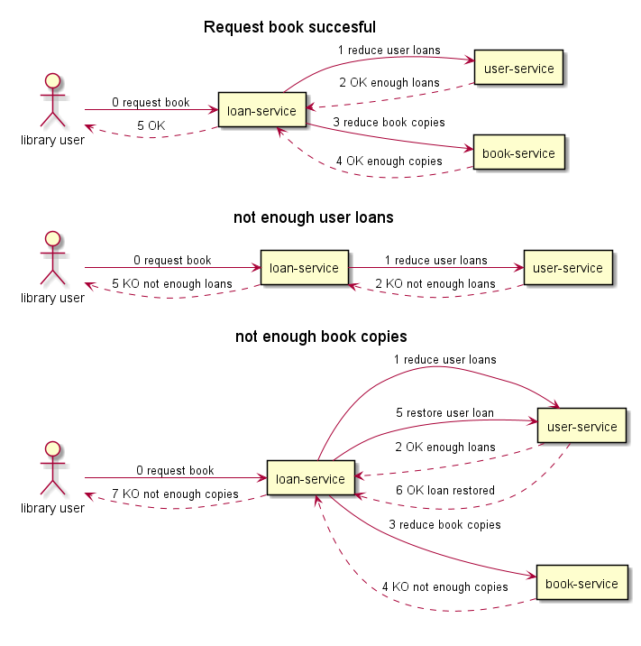
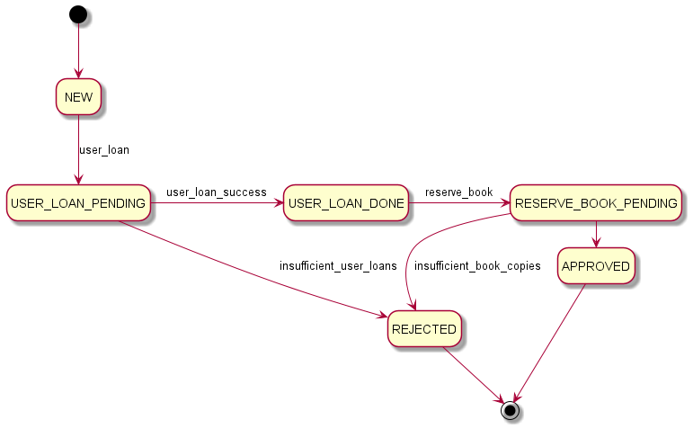

# Library Microservices
Sagas con máquina de estados y mensajería Kafka.

**Lógica de negocio**

* Un préstamo se asocia a un usuario y a un libro.
* Cada usuario tiene asociado un número de préstamos simultáneos (que se reduce cuando se hace un préstamo)
* Cada libro tiene un número de ejemplares disponibles (que se reduce cuando se hace un préstamo)
* Cuando se hace un préstamo, sólo se crea de forma satisfactoria si el usuario puede tiene préstamos disponibles y hay ejemplares del libro
* La aplicación debe ofrecer una API REST de los 3 recursos: préstamos, usuario y libro

**Saga**

* El servicio orquestador esta en loan-service
* Se reducirá el número de préstamos disponibles del usuario primero.
* Si no hay ejemplares del libro disponibles se vuelve a aumentar el número de préstamos (como una transacción de compensación)

**Estados**

**Servicios**

* loan-service: https://bootify.io/app/G4YVQKMTL7DB
* user-service: https://bootify.io/app/X97SMVNTZ1X5
* book-service: https://bootify.io/app/4UR3KO16RSIN

**Arranque de mysql y kafka**

	docker-compose -f docker-compose-mysql.yaml up

* UI for Kafka http://localhost:8888/ui

**Arranque de servicios**

docker-compose up

**Contruir los artefactos y arrancar los servicios**

    cd library-commons
    gradle build
    cd..
    gradlew build

Running customer-service

    cd book-service
    gradle bootRun

Running book-service

    cd book-service 
    gradle bootRun

Running loan-service

    cd loan-service 
    gradle bootRun

**Alta de prestamo**

    curl --location --request POST 'http://localhost:8083/new-loan' \
    --header 'Content-Type: application/json' \
    --data-raw '{
    "idUser": 1,
    "idBook": 1
    }'

